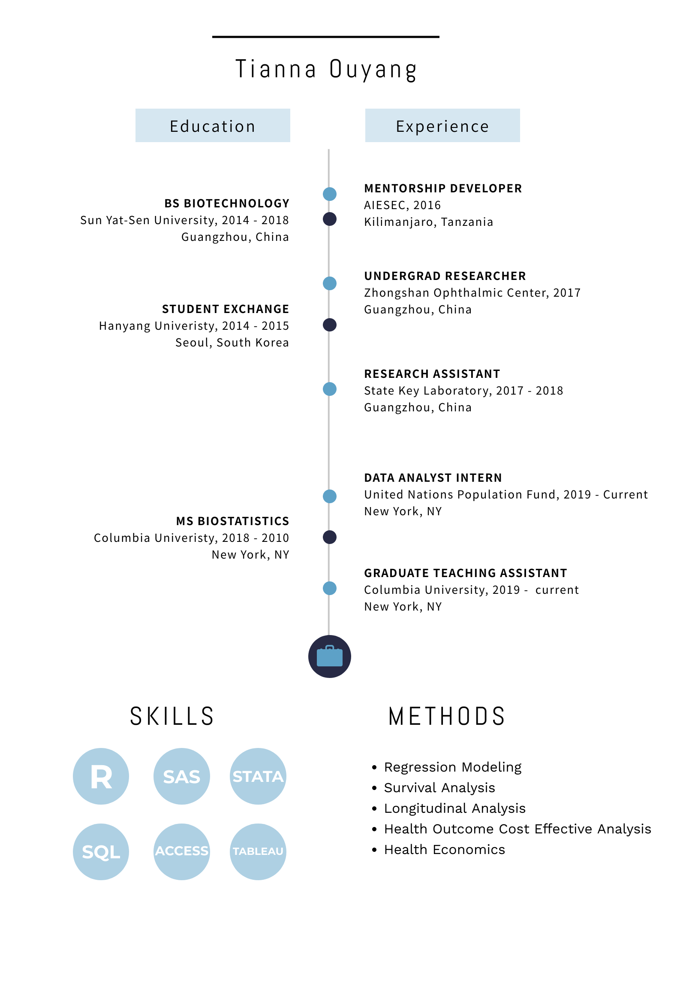

 

### In a nutshell

 

### Publications
* __T Ou-yang__, F Xia, L Qiu. Acidicapsa dinghuensis sp. nov., a novel acidobacterium isolated from forest soil. *International Journal of Systematic and Evolutionary Microbiology*. Volume 68, Issue 7. https://doi.org/10.1099/ijsem.0.002846
* F Xia, __T Ou-yang__, Z Gao, L Qiu. Edaphobacter flagellatus sp. nov. and Edaphobacter bradus sp. nov., two acidobacteria isolated from forest soil. *International Journal of Systematic and Evolutionary Microbiology*. Volume 68, Issue 8. https://doi.org/10.1099/ijsem.0.002871

 

### Courseworks
* Data Science, Fall 2019
* Relational Databases and SQL Programming, Fall 2019
* Analysis of Large Scale Data, Fall 2019
* Probability, Fall 2019
* Applied Regression, Spring/Fall 2019
* Statistical Computing with SAS, Spring 2019
* Analysis of Categorical Data, Spring 2019
* Introduction to Health Economics, Fall 2019
* Decision Analysis for Clinical and Public Health Practices, Spring 2019
* Health Systems, Fall 2018

 

### Resume
* My resume is available [here](downloads/[Tianna Ouyang] Resume.pdf).

